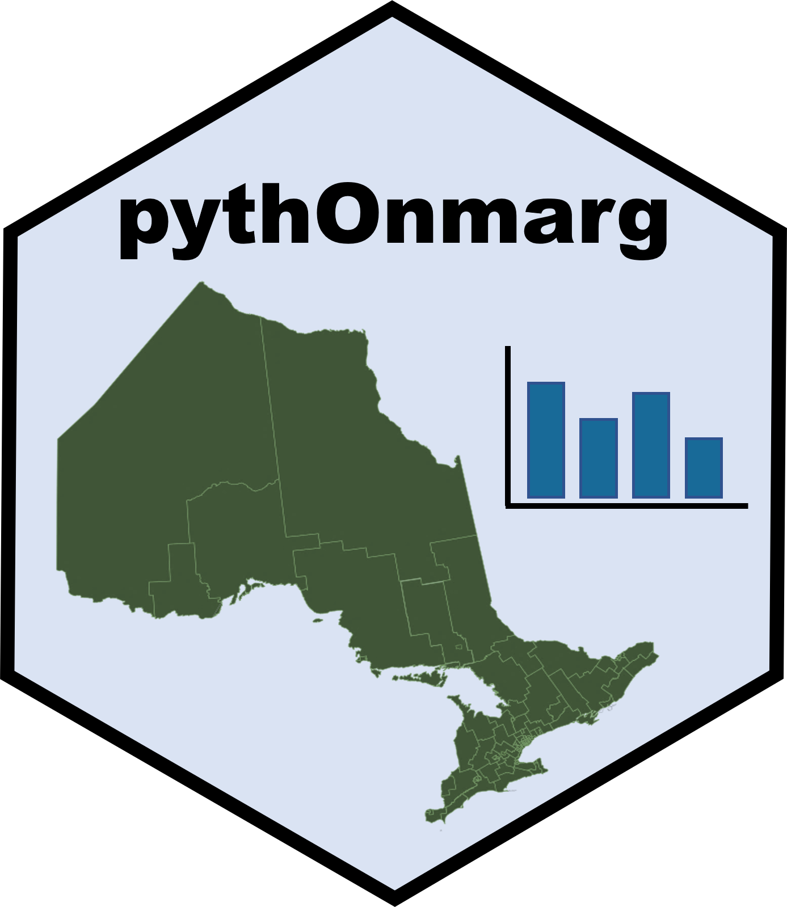

# pythOnmarg 


[](https://pepy.tech/project/pythOnmarg)
[](https://pepy.tech/project/pythOnmarg)

The Python version of the onmaRg package.

pythOnmarg makes Public Health Ontario's "Ontario Marginalization Index" (OnMarg) datasets accessible as a geo dataframe using spatial files from Statistics Canada.  OnMarg data can be loaded for the 2011, 2016, and 2021 data sets.  The inclusion of all levels of Stats Canada geography means data can be filtered by CD, CSD, etc.

---

## Documentation

General:
- [om_data](https://github.com/WiIIson/pythOnmarg/blob/main/docs/om_data.md)
- [om_geo](https://github.com/WiIIson/pythOnmarg/blob/main/docs/om_geo.md)

---

## Installation

pythOnmarg can be installed from PyPi with the following command:
```python
pip install pythOnmarg
```

Once installed, the package is loaded with the following line:
```python
import pythOnmarg
```

Project dependencies can be seen [here](https://github.com/WiIIson/pythOnmarg/blob/main/pyproject.toml).

---

## Community Guidelines

Contributions to the project are welcome! These can be initiated through the project's issue tracker or through a pull request. Suggestions for feature enhancements, tips, as well as general questions and concerns can also be expressed through direct interaction with contributors and developers.

If you experience any challenges with this module such as bugs, test support, or feature requests, please feel free to use this [issue tracker](https://github.com/WiIIson/pythOnmarg/issues).

---

## Citations

This package can be cited as follows:
```bibtex
@software{Conley_pythOnmarg_2024,
  author = {Conley, D. William},
  month = {09},
  title = {{pythOnmarg Package}},
  url = {https://github.com/WiIIson/pythOnmarg},
  version = {0.0.1},
  year = {2024},
  note = "{\tt william@cconley.ca}"
}
```